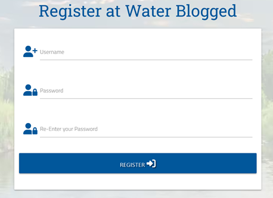

# [PROJECT3 WATERBLOGGED](https://water-blogged-flask-app-0fb53df2979a.herokuapp.com)

[](https://github.com/Coelecanth/project3-waterLogged/commits/main)
[](https://github.com/Coelecanth/project3-waterLogged/commits/main)
[](https://github.com/Coelecanth/project3-waterLogged)

My project idea was to create a journal for fly fisherman, who could use this as a blog site to share with people.  

This was born out the research I did on this and there didn’t seem to be a site out there that could deliver this specifically for fly fishers. Specifically a site to share your individual experiences with others fly fishers where it wasn’t just sole platform for one fly fisher. Create a collective of like minded individuals who all share there experiences in the same place. I chose the name the name Water Blogged as plagurism of the expression "water logged", which could have two meaning of soaked or a journal for the water.  

Essentially the idea was for the fly fisherman to be able to record there fishing sessions which could be a simple local visit or at the other end of the spectrum, a full expedition holiday. Where they could record most of the useful information on the place they visited, and then share this with others, provide information such as location.
 To show how they rated individual visits and the locations of these venues.


See the fully interactive version here - source:  [amiresponsive](https://ui.dev/amiresponsive?url=https://water-blogged-flask-app-0fb53df2979a.herokuapp.com)

## UX

The UX for this site was very much driven by the need to be simple to use, without explaantion. Also, that the site is an interactive site driven by a database, and so needed to have clean way of potentially showing hundreds of records of data, and provide access to a known identity.  
So the structure of the site was presented in the following way;
- Logon page 
- Logoff page
- Recognition of user type (eg superuser), user can check who they think they are. 
- Create, update, delete of data records
- integrate graphical location data into the above data record management 
- Simplify selection for known repeatble data types 
- Make it easy for user to update their own data records

The look and feel of the site would be represented by colours, imagery, and icons relating to the subject matter, the colour scheme would be reflective of this. I chose to use Materize CSS as a the CSS framework to assist me with creating the look and feel of the site. In hindsight this may not have been the best choice as there was found to be some serious flaws and stability issues (see [TESTING.md](TESTING.md))

The layout of the pages would be centred to allow the information to be displayed in a pleasing not cluttered maner, but with wide margins to allow imagery of the river scene to be visible both to the side and behind. The vivid imagery used for the river initally could be distracting so I decided to tone this down by fading the image with a grey tone to compliment the colour scheme. 

### Colour Scheme

The colour scheme chosen was to provide an idyllic reflective colour scheme of the river or lake environment with greens and blues, and deeper shades represented by grey. As I was using Materialize CSS framework, which has good functionality for colours. I decided to match my colour scheme, using the Materialize colour scheme, so where I couldn’t use the Materialize framework i could call a css class.  

- Materialize grey lighten-2 - defined as class l-grey colour #e0e0e0
- Materialize teal darken-1 - defined as class teal colour #00897b
- Materialize teal darken-4 - defined as class green colour #004d40 
- Materialize grey lighten-2 - defined as class blue colour #0d47a1
- Materialize grey darken-2 - defined as class d-grey colour #616161 


The colour scheme was refined and tuned in the [coolors.co](https://coolors.co/bac1b8-00897b-0c7c59-0d47a1-2b303a) web site and the link shows the colour scheme as seen from the website. 

For completeness the colour scheme is shown below as an image 
 


### Typography

I used the website [fontjoy](https://fontjoy.com/) to pick a pair of fonts which are complimentary in there styles but provide a mild contrast to the rest of the text on the page. The fonts chosen were sourced from google fonts and imported into my css. These were then applied with there own classes to selected text componets in the site.
The fonts used are shown below    

- [Roboto Slab](https://fonts.google.com/specimen/Roboto+Slab) was used for the primary headers and titles.

- [Titillium web](https://fonts.google.com/specimen/Titillium+Web) was used for other secondary text.

#### Icons
I used [Fontawesome](https://fontawesome.com/icons) for the icons as it was able to provide the diverse collection of Icons I needed to repreent the individual elelemts, and provided good support for my needs with CDN. The list of icons I used from font awesome are as follows 

- [Mountain icon](https://fontawesome.com/icons/mountain-sun?f=classic&s=solid)
- [Location Dot icon](https://fontawesome.com/icons/location-dot?f=classic&s=solid)
- [Temperature icon](https://fontawesome.com/icons/temperature-three-quarters?f=classic&s=solid)
- [Fish icon](https://fontawesome.com/icons/fish-fins?f=classic&s=solid)
- [Fly icon](https://fontawesome.com/icons/mosquito?f=classic&s=solid)
- [Cloud icon](https://fontawesome.com/icons/cloud?f=classic&s=solid)
- [Calendar icon](https://fontawesome.com/icons/calendar-days?f=classic&s=solid)
- [Notes icon](https://fontawesome.com/icons/align-left?f=classic&s=solid)
- [Favicon - Fish icon](https://fontawesome.com/icons/fish-fins?f=classic&s=solid)

## User stories

### New Site Users
- As a new site user, I would like to register on the site, so that I am known by the site and my entries are recorded to me.
- As a new site user, I would like to record new fishing, which are attributed to me on creation.
- As a new site user, I would like to be able to select whether my entries are public or private (e.g. so that only I can see them or all users can see them, at both time of creation or later update).
- As a new site user, I would like to be able to see all entries I have created 
- As a new site user, I would like to be able to see all entries that are public 
- As a new site user, I would like to record the following elements in the site,
  - Venue name I visited and the topography eg river lake, sea, etc
  - The conditions, weather, water temperature etc.
  - The fish caught and the flies used to catch them.
  - Have notes section where I can add my own comments and also place links to any Images I may wish link to this session eg host my own photographs.
  - Link a geo location so I can show where this venue is, making it easier for readers of public session to find it, (or even to remember for myself) 
  - Record  my rating of the session, good, average, bad, and then show this rating in my overall list of entries I created.
- As a new site user, I would like to be able to edit the records I have created for the  following elements of each session recorded,
  - Venue name I visited and the topography eg river lake, sea, etc
  - The conditions, weather, water temperature etc.
  - The fish caught and the flies used to catch them.
  - Have notes section where I can add my own comments and also place links to any Images I may wish link to this session eg host my own photographs.
  - Link a geo location so I can show where this venue is, making it easier for readers of public session to find it, (or even to remember for myself) 
  - Record  my rating of the session, good, average, bad, and then show this rating in my overall list of entries created.
- As a new site user, I would like to be able to search document for elements such as 
  - Venue others have visited previously 
  - Fish they have caught and from where
  - Venue which have been given a good rating( or bad, or average) 

### Returning Site Users
- As a  a returning site user, I would like to logon to the site, so that I am known by the site.
As a returning site user, I would like to record new fishing sessions, which are attributed to me.
-	As a returning site user, I would like to be able to select whether my entries are public or private (e.g. so that only I can see them or all users can see them, at both time of creation or later update).
- As a returning site user, I would like to be able to see all entries I have created 
- As a returning site user, I would like to be able to see all entries that are public 
- As a returning site user, I would like to record new sessions with the following elements in the site,
  - Venue name I visited and the topography eg river lake, sea, etc
  - The conditions, weather, water temperature etc.
  - The fish caught and the flies used to catch them.
  - Have notes section where I can add my own comments and also place links to any Images I may wish link to this session eg host my own photographs.
  - Link a geo location so I can show where this venue is, making it easier for readers of public session to find it, (or even to remember for myself) 
  - Record  my rating of the session, good, average, bad, and then show this rating in my overall list of entries I created.
- As a returning site user, I would like to be able to edit the records I have created for the  following elements  of each session recorded,
  - Venue name I visited and the topography eg river lake, sea, etc
  - The conditions, weather, water temperature etc.
  - The fish caught and the flies used to catch them.
  - Have notes section where I can add my own comments and also place links to any Images I may wish link to this session eg host my own photographs.
  - Link a geo location so I can show where this venue is, making it easier for readers of public session to find it, (or even to remember for myself) 
  - Record  my rating of the session, good, average, bad, and then show this rating in my overall list of entries created.
  - As a returning site user, I would like to be able to search a document for elements such as 
  - Venue I have or other have visited previously 
  - Fish I have caught and from where
  - Venue which have been given a good rating ( or bad, or average) 

### Site Admin
- As a site administrator, I should be able to change the location types  types for fishing , so that I can add edit or delete details such as Lake , river , or add different subcategories to this.
- As a site administrator, I should be able to been given access to these functions as an administrator, e.g. they’re not globally available to all.
- As a site administrator, I should be able to perform all the create, edit update and delete function taht both new ansd retunring site users can do. 

## Wireframes

The wireframes shown below are representativer of both desktop and tablet sized screens as the framing layout for this is the same with just the margins smaller either side. 
 
### Desktop and Tablet Wireframes 
                  
| List Records Page  | Edit/Add Records Page |  Edit categories Page | 
------------- | ------------- | ------------- |
| |  | |
| logon-logoff-register Page  |  | 
| | |  | |

### Mobile Wireframes
 | List Records Page  | Edit/Add Records Page |  Edit categories Page | 
------------- | ------------- | ------------- |
| |  | |
| logon-loggoff-register Page  |  | 
| | |  | |


## Features

### Existing Features

#### **Password Integrity**
- So to make the user experience more predictable and easier to use I introduced on register of an account the feature to enter your password twice to make sure the password is the same on both entries to prevent typographical mistakes when entering your password on user register.  Together with the features to force users to create usernames and password with the following characteristics using regular expressions
  -	Min characters 5
  -	Max characters 15
  -	Constructed of the following characters 
  -	a-z, A-Z, numbers 0-9




#### **Superuser Identity**
 The site originally contained the check of the superuser identity in the html of the pages of the site which is not secure as not only can you see the identity its checking for, but it would be possible to change the page contents and post this forcing past the identity check. For this reason, I changed the verification of superuser identity.
 - No longer tying it to a username and now storing the verification in MongoDb. 
 - The verification is now performed in Python code, where upon the logon of the user identity, user is checked for the user key "is_superuser" = True
 - If this value is returned as true the user is granted the superuser status
 - The is key "is_superuser" is created by python on register of the user and is created as False 
 - The only way to set the user as superuser is through mongo DB and updating this to True
 - So, to circumvent this you would have to access to either the python code or Mongo DB. 
 - The user status as a superuser is confirmed at the profile page


#### **Geo Location for Places Fished**

With this project I used Leaflet an open-source interactive map which would then allow the user when they are creating entries in the add or edit record to add or change a map location where they have been fishing. This can then be viewed in the list of all records created for in the site. The implemtation required some consideration as to have mutiple maps shown on the listing page would have been detrimental to performance and stability, having mutiple maps all laoding and opening at the same time. For this a modal was chosen as the mechanism to show the maps as this would mean there would only be one map open at any given time. 


#### **Session rating for places fished**

- So for this project I added rating for each session you create.
- The rating is exposed as a tool tip and Icon on each record, so removing the need to open the record, you just need to hover it, and in additon to this the rating is also colour coded.
- This was created speciifcally as searchable item so the idea being as a user I could from the listing page search for all session marked as good.
- The rating are colour coded as follows;
  - Green - Good
  - Yellow - Average
  - Red - Bad
  - blue - not rated
- Upon opening the record the viewer, can read then further detail from the author to say why it was bad or good, so providing the user with a valuable reserach tool. 
    


### Future Features

#### **Public/Private Entries** 
So as part of the features for the user I wanted to develop a feature where when the user creates a session record, and they can chose to make this a public or private record document in the fdata collection. This would allow the user to extend the site to become not only a blog, but a personal journal of their fishing sessions, and then if they  wish to share these with the greater community using the site, thye can by making the record public.

The implementation of this would be achieved in the following steps.
- The document created by the user would have a switch/toggle entry making it public or private.
- So this record would then be shown if made public in home page view, when you clicked on the home tab from the navbar, which is the default mode of operation.
- If the user had set this record to private it would not be shown in the home tab view.
- The record would then only be shown when clicking on the user’s profile tab as this would exclusive to them.
- It would also include public record that the current logged on user had created as well in the view.
- The records (public/private) would be differentiated by a tool tip on the record with a padlock icon (open or closed) in different colours.

As of submission this feature was not fully completed, but the following elements have been completed.
- Creation of the switch in add record to set public or private
- Edit records to change this record from public or private.
- The storing adding/updating of the switch value in Mongo DB, eg fd_public = on or off

Out standing are:
- Profile page listing with both public and private records for the current user and the filter logic required for this.
- The addition of the padlock tool (showing public/private) tip to each record in profile view
- The filtering in the home tab view to include the current abilities of 
  - Edit users records that are created by the current user, (not anyone else)
  - Show all records of everyone else
  - Then additional filtering of only showing records from the current user which are set to public.


## Tools & Technologies Used

### Code and Frameworks 
1. HTML5
2. CSS3
3. Javascript
4. Pyhton
5. Flask 
6. Jinja templating 
7. jquery
8. Javascript

### Tools
- [](https://tim.2bn.dev/markdown-builder) used to generate README and TESTING templates.
- [](https://git-scm.com) used for version control. (`git add`, `git commit`, `git push`)
- [](https://github.com) used for secure online code storage. 
- [](https://gitpod.io) used as a cloud-based IDE for development.
- [](https://code.visualstudio.com) used as my local IDE for development.
- [](https://en.wikipedia.org/wiki/HTML) used for the main site content.
- [](https://en.wikipedia.org/wiki/CSS) used for the main site design and layout.
- [](https://www.javascript.com) used for user interaction on the site.
- [](https://jquery.com) used for user interaction on the site with materiliaze and also Leaflet 
- [](https://www.python.org) used as the back-end programming language.
- [](https://www.heroku.com) used for hosting the deployed back-end site.
- [](https://materializecss.com) used as the front-end CSS framework for modern responsiveness and pre-built components.
- [](https://flask.palletsprojects.com) used as the Python framework for the site.
- [](https://www.mongodb.com) used as the non-relational database management with Flask.
- [](https://balsamiq.com/wireframes) used for creating wireframes.
- [](https://leafletjs.com) used as a free open-source interactive map on my site.
- [](https://fontawesome.com) used for the icons.
- [](https://chat.openai.com) used to help debug, troubleshoot, and explain things.
- [Squoosh](https://squoosh.app/) Squooosh was used to perform the following functions convert the images from jpg to Avif, Also to resize (reduce pixel count) the images to a more manageable size to improve download speed.
- [Google Fonts](https://fonts.google.com/) Google fonts was used to source the fonts that were selected from Fontjoy. 
- [FontJoy](https://fontjoy.com/) Font joy was used in the design process to create a palette of fonts, to be empathic with the site topic, and provide contrast between various type styling. 
  - **Quote** from https://fontjoy.com/  
 *The goal of font pairing is to select fonts that share an overarching theme yet have a pleasing contrast. Which fonts work together is largely a matter of intuition, but we approach this problem with a neural net.*

## Database Design

My project uses a non-relational database with MongoDB, and therefore the database architecture
doesn't have actual relationships like a relational database would.

My database is called **fishingLog**.

It contains 3 collections:

- **categories**
    | Key | Type | Notes |
    | --- | --- | --- |
    | _id | ObjectId() | |
    | cat_name | String | text description of water, eg lake, river, sea |

- **fdata**
    | Key | Type | Notes |
    | --- | --- | --- |
    | _id | ObjectId() | |
    | fd_cat_name | String | selected from *categories* collection frotype of water|
    | fd_venue | String | fishing venue name |
    | fd_date | String | date of recorded session |
    | fd_conditions | String | fishing conditions, weather, etc. |
    | fd_rate | String | user rating for the session they have recorded |
    | fd_wtemp  | String | water temperature |
    | fd_fish  | String | fish caught |
    | fd_flylure | String | type of fly/flies used  |
    | fd_comment | String | free text section to descriptions or links for say pictures |
    ! fd_geoloc | String | numerical string giving co-ordinates to a map location  |
    | fd_public  | String | toggle switch for make record public - future feature|
    | fd_created_by | String | user who recorded session derived from session ID |

- **users**
    | Key | Type | Notes |
    | --- | --- | --- |
    | _id | ObjectId() | |
    | username | String | |
    | password | String | uses Secure Hash Algorithm (SHA) |
    | is_superuser | String | Used to identify super user for database |

## Testing

> [!NOTE]  
> For all testing, please refer to the [TESTING.md](TESTING.md) file.

## Deployment

The live deployed application can be found deployed on [Heroku](https://water-blogged-flask-app-0fb53df2979a.herokuapp.com).

### MongoDB Non-Relational Database

This project uses [MongoDB](https://www.mongodb.com) for the Non-Relational Database.

To obtain your own MongoDB Database URI, sign-up on their site, then follow these steps:

- The name of the database on MongoDB should be called **fishingLog**.
- The collection(s) needed for this database should be **categories, fdata, users**.
- Click on the **Cluster** name created for the project.
- Click on the **Connect** button.
- Click **Connect Your Application**.
- Copy the connection string, and replace `password` with your own password (also remove the angle-brackets).

### Heroku Deployment

This project uses [Heroku](https://www.heroku.com), a platform as a service (PaaS) that enables developers to build, run, and operate applications entirely in the cloud.

Deployment steps are as follows, after account setup:

- Select **New** in the top-right corner of your Heroku Dashboard, and select **Create new app** from the dropdown menu.
- Your app name must be unique, and then choose a region closest to you (EU or USA), and finally, select **Create App**.
- From the new app **Settings**, click **Reveal Config Vars**, and set your environment variables.

> [!IMPORTANT]  
> This is a sample only; you would replace the values with your own if cloning/forking my repository.

| Key | Value |
| --- | --- |
| `DATABASE_URL` | user's own value |
| `IP` | 0.0.0.0 |
| `MONGO_DBNAME` | user's own value |
| `MONGO_URI` | user's own value |
| `PORT` | 5000 |
| `SECRET_KEY` | user's own value |

Heroku needs three additional files in order to deploy properly.

- requirements.txt
- Procfile
- runtime.txt

You can install this project's **requirements** (where applicable) using:

- `pip3 install -r requirements.txt`

If you have your own packages that have been installed, then the requirements file needs updated using:

- `pip3 freeze --local > requirements.txt`

The **Procfile** can be created with the following command:

- `echo web: python app.py > Procfile`
- *replace **app.py** with the name of your primary Flask app name; the one at the root-level*

The **runtime.txt** file needs to know which Python version you're using:
1. type: `python3 --version` in the terminal.
2. in the **runtime.txt** file, add your Python version:
	- `python-3.9.19`

For Heroku deployment, follow these steps to connect your own GitHub repository to the newly created app:

Either:

- Select **Automatic Deployment** from the Heroku app.

Or:

- In the Terminal/CLI, connect to Heroku using this command: `heroku login -i`
- Set the remote for Heroku: `heroku git:remote -a app_name` (replace *app_name* with your app name)
- After performing the standard Git `add`, `commit`, and `push` to GitHub, you can now type:
	- `git push heroku main`

The project should now be connected and deployed to Heroku!

### Local Deployment

This project can be cloned or forked in order to make a local copy on your own system.

For either method, you will need to install any applicable packages found within the *requirements.txt* file.

- `pip3 install -r requirements.txt`.

> [!IMPORTANT]  
> This is a sample only; you would replace the values with your own if cloning/forking my repository.

Sample `env.py` file:

```python
import os

os.environ.setdefault("IP", "0.0.0.0")
os.environ.setdefault("MONGO_DBNAME", "user's own value")
os.environ.setdefault("MONGO_URI", "user's own value")
os.environ.setdefault("PORT", "5000")
os.environ.setdefault("SECRET_KEY", "user's own value")

# local environment only (do not include these in production/deployment!)
os.environ.setdefault("DB_URL", "user's own value")
os.environ.setdefault("DEBUG", "True")
os.environ.setdefault("DEVELOPMENT", "True")
```
#### Cloning

You can clone the repository by following these steps:

1. Go to the [GitHub repository](https://github.com/Coelecanth/project3-waterLogged) 
2. Locate the Code button above the list of files and click it 
3. Select if you prefer to clone using HTTPS, SSH, or GitHub CLI and click the copy button to copy the URL to your clipboard
4. Open Git shell or Terminal
5. Change the current working directory to the one where you want the cloned directory
6. In your IDE Terminal, type the following command to clone my repository:
	- `git clone https://github.com/Coelecanth/project3-waterLogged.git`
7. Press Enter to create your local clone.

Alternatively, if using Gitpod, you can click below to create your own workspace using this repository.

[](https://gitpod.io/#https://github.com/Coelecanth/project3-waterLogged)

Please note that in order to directly open the project in Gitpod, you need to have the browser extension installed.
A tutorial on how to do that can be found [here](https://www.gitpod.io/docs/configure/user-settings/browser-extension).

#### Forking

By forking the GitHub Repository, we make a copy of the original repository on our GitHub account to view and/or make changes without affecting the original owner's repository.
You can fork this repository by using the following steps:

1. Log in to GitHub and locate the [GitHub Repository](https://github.com/Coelecanth/project3-waterLogged)
2. At the top of the Repository (not top of page) just above the "Settings" Button on the menu, locate the "Fork" Button.
3. Once clicked, you should now have a copy of the original repository in your own GitHub account!


## Credits
I would like acknowledge the use of the following sites and help in building this site. 

### Content

- Tim Nelson - [flask-task-manager-project](https://github.com/TravelTimN/flask-task-manager-project/blob/demo/app.py#L22-L33)
- Tim Nelson - [Mardown Builder](https://tim.2bn.dev/markdown-builder/)

| Source | Location | Notes |
| --- | --- | --- |
| [Markdown Builder](https://tim.2bn.dev/markdown-builder) | README and TESTING | tool to help generate the Markdown files |
| [Chris Beams](https://chris.beams.io/posts/git-commit) | version control | "How to Write a Git Commit Message" |
| [W3Schools](https://www.w3schools.com/howto/howto_js_topnav_responsive.asp) | entire site | responsive HTML/CSS/JS navbar |
| [Materialize css](https://materializecss.com/) | entire site | css framework and formatting 


### Media

 - [Icons for edit/add pages from font awesome](https://fontawesome.com/search?q=fish&o=r&m=free)
 - [Fish Favicons from font awesome](https://fontawesome.com/icons/fish-fins?f=classic&s=solid)
 - [Pexels image river image - free](https://www.pexels.com/photo/body-of-water-and-green-field-under-blue-sky-photo-1179225/)


| Source | Location | Type | Notes |
| --- | --- | --- | --- |
| [Pexels](https://www.pexels.com) | entire site | image | favicon on all pages |
| [Squoosh](hhttps://squoosh.app/) | entire site | image | resizing and image format chnaging |

### Acknowledgements

- I would like to thank my Code Institute mentor, [Tim Nelson](https://github.com/TravelTimN) for his support and deep knowlege and help advice throughout the development of this project, and his support which kept me going during periods of self doubt and imposter syndrome. 
- I would like to thank the [Code Institute](https://codeinstitute.net) tutor team for their assistance, patience with troubleshooting and debugging my project issues.
- I would like to thank my tutor Ben Smith at Bristol college for his help and advice. 
- I would like to thank the [Code Institute Slack community](https://code-institute-room.slack.com) for showing "I'm not the only one", and persisting. 