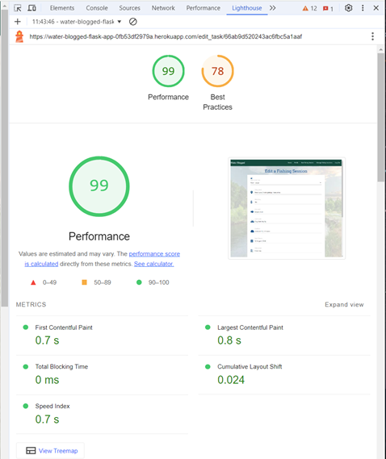
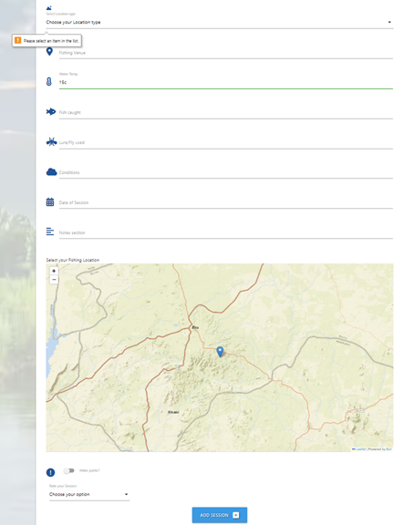
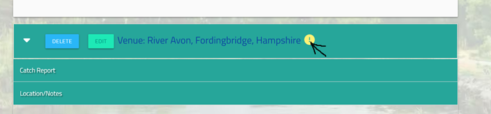

# Testing

> [!NOTE]  
> Return back to the [README.md](README.md) file.

The structure of the Testing for "Water Blogged" is as follows  

## Feature Testing:

### Usability Testing
- User can register and password are checked for consistency
- the navigation bar functions correctly 
- User can Logon and logoff
- User can create, update and delete their own records  
- The session rating function is working 
- The geo-location recording is working

### Defence programming 

In this section we test that users can only access features and functionality they are supposed to be able to access 
This would include 
- Performing CRUD operations only on records that they have created  
- Superuser have access to Super user functions and normal user do not 
- Normal user not being able to brute force there way into pages to access super user features

## Compatibility Testing:

- Browser Compatibility: Testing on different browsers (Chrome, Firefox, Safari, Edge, etc.) to ensure consistent performance.
- Device Compatibility: Ensuring functionality across various devices (desktops, laptops, tablets, and mobile phones).

## Regression Testing:

## Documentation and Logs:

Maintain records of testing procedures, results, and any bugs encountered along with their resolutions. This helps demonstrate a systematic approach to testing and problem-solving.
User Feedback Incorporation:

If applicable, mention how user feedback has been taken into account and implemented to enhance the user experience.

## Code Validation
 the following items were code checked 
 - HTML
 - Javascript
 - Python
 - CSS

### HTML

I have used the recommended [HTML W3C Validator](https://validator.w3.org) to validate all of my HTML files.

| Directory | File | Screenshot | Notes |
| --- | --- | --- | --- |
| templates | add_tasks.html | | |
| templates | edit_task.html |  | |
| templates | login.html |  | |
| templates | profile.html |  | |
| templates | register.html |  | |
| templates | tasks.html |  | |
| templates | categories.html |  | |

### CSS

I have used the recommended [CSS Jigsaw Validator](https://jigsaw.w3.org/css-validator) to validate all of my CSS files.

All the errors found (x3 errors and x649 Warnings) were with frameworks that were being used on Water Blogged site,
the Errors were from: 
 - Leaflet
 - Materiaze 

The Warning were from
 - Font Awesome 

| Directory | File | Screenshot | Notes |
| --- | --- | --- | --- |
| static | style.css |  | |

### JavaScript

I have used the recommended [JShint Validator](https://jshint.com) to validate all of my JS files.

The JSHint tool showed only warning for the JSscript for the Leaflet Geo Location

| Directory | File | Screenshot | Notes |
| --- | --- | --- | --- |
| static | js_script.js |  |  Jscript for Materialize CSS functions |
| static | add_task.html |  |  Jscript for add in g location for geo-location function Leaflet  |
| static | edit_task.html |  |  Jscript for edit location for geo-location function Leaflet  |

### Python

I have used the recommended [PEP8 CI Python Linter](https://pep8ci.herokuapp.com) to validate all of my Python files.

| Directory | File | CI URL | Screenshot | Notes |
| --- | --- | --- | --- | --- |
|  | app.py | [PEP8 CI](https://pep8ci.herokuapp.com/https://raw.githubusercontent.com/Coelecanth/project3-waterBlogged/main/app.py) |  | |

## Browser Compatibility

| Browser | Home | add user | register | Notes |
| --- | --- | --- | --- | --- | 
| Chrome |  |  |  | Works as expected |
| Firefox |  |  |  | Works as expected |
| Edge |  |  |  | Works as expected |

## Responsiveness

I tested for responsiveness for the following 3 tests:
- Mobile
- Tablet
- Desktop

I've tested my deployed project on multiple devices to check for responsiveness issues.

| Device | Home | Add | register | Notes |
| --- | --- | --- | --- | --- | 
| Mobile (DevTools) |  |  |  | Works as expected |
| Tablet (DevTools) |  |  |  | Works as expected |
| Desktop |  |  | | Works as expected |

## Lighthouse Audit

The following pages were tested for performance using the lighthouse test tool in Chrome 

 - Home page
 - Add page
 - Edit page
 - Profile page
 - Categroies 

Any warning or errors noted were investigated below. 

### Home page
Although the performance was 100%, the warnings received on this page were all related to the frameworks and fetures used, in partcular they were 
 - Leaflet
 - Materize CSS
 - heroku 

### Add page
Although the performance was 99%, The warnings received on this page (hence 78% best practice) were all related to the frameworks and fetures used, in partcular they were 
 - Leaflet
 - Materize CSS
 - heroku 

 ### Edit page
Although the performance was 99%, The warnings received on this page (hence 78% best practice) were all related to the frameworks and fetures used, in partcular they were 
 - Leaflet
 - Materize CSS
 - heroku 
 - Esri ArcGIS
 
### Profile page
Although the performance was 99%, the warnings received on this page were all related to the frameworks and fetures used, in partcular they were 
 - Leaflet
 - Materize CSS
 - heroku  

### Categories page
Both performance and Best practice were close to or were 100%, And there some warnings received on this page. These were all related to the frameworks and fetures used, in partcular they were 
 - Leaflet
 - Materize CSS
 - heroku 

### Lighthouse Testing Results 
I've tested my deployed project using the Lighthouse Audit tool to check for any major issues.

| Page | Desktop | Notes |
| --- | --- | --- |
| Home |  | Some minor warnings |
| Profile | | Some minor warnings |
| Add |   | Some minor warnings  |
| Add |   | Some minor warnings  |
| Categories |  | Some minor warnings  |

## Defensive Programming

I tested the following elelments in my defensive testing 
- Users cannot submit an empty form 
- User must enter valid Names and passwords
    - In particualr that there passwords are correct eg by asking for the psssword to be entered twice
- Users must enter a valid letter/word/string when prompted for both fields and names and passwords
- Users cannot brute-force a URL to navigate to a restricted page
- Users cannot perform CRUD functionality while logged-out
- User-A should not be able to manipulate data belonging to User-B, or vice versa
- Non-Authenticated users should not be able to access pages that require authentication
- Standard users should not be able to access pages intended for superusers

Defensive programming was manually tested with the below user acceptance testing:

| Page | Expectation | Test | Result | Fix | Screenshot |
| --- | --- | --- | --- | --- | --- |
| Home | | | | | |
| | When the user is not logged on as a user, they should be able to see records, and have no ability to edit records  | Tested the feature by loading the default site page | The feature behaved as expected, and the page was loaded showing records without any edit function either on records or in the navbar | Test concluded and passed |  |
| | User (not logged on) cannot brute force there way to ADD records from home page | Tested this by copying the URL for add records (From a logged on user) and then pasting this into a browser, in the current not logged on session | The page reloaded with the message "You need to logon", loading the logon page. | Test concluded and passed |  |
| | User (not logged on) cannot brute force there way to EDIT records from home page | Tested this by copying the URL for edit records (From a logged on user) and then pasting this into a browser, in the current not logged on session | The page reloaded with the message "You need to logon", loading the logon page. | Test concluded and passed |  |
| | User (not logged on) cannot brute force there way to superuser features such as edit/add/categories | Tested this by copying the URL for edit categries (From a logged on superuser) and then pasting this into a browser, in the current not logged on session | The page reloaded with the message "You need to logon", loading the logon page. | Test concluded and passed |  |
| | Logged on user cannot brute force there way to EDIT records from home page for other peoples records  | Tested this by copying the URL for edit records (From a different logged on user) and then pasting this into a browser, in the current logged on session | The page reloaded with the message "You dont have access to this page", loading the home page. | Test concluded and passed | | 
| | Logged on standard user cannot brute force there way to superuser features such as edit/add/categories | Tested this by copying the URL for edit categries (From a logged on superuser) and then pasting this into a browser, in the current not logged on session. Was then repeated for the ADD categroies, EDIT categroies. | For each of tests, the result was the same. The page reloaded with the message "Access denied: superuser access only", loading the home page. | Test concluded and passed |  |
| | Logged on standard user cannot brute force there way to superuser feature of  delete categories | Tested this by copying the URL for edit categries (From a logged on superuser) and then pasting this into a browser, in the current not logged on session. The delte categories calls a modal. So in this test I copied just the Modal URL and appended this to URL for the site e.g.   "get_categories#modal-66b0ca41aa243e156b3aaa16" to test this. | The page reloaded with the message "Access denied: superuser access only", loading the home page. | Test concluded and passed |  |
Logon/Logoff | | | | | |
| | When Logged in with a standard user level account, they should not see the edit categories in the navbar | Logged on with the standard account and was taken to the profile page | The feature behaved as expected, the navbar did NOT show the edit categories page and the profile text tells me "Im not a supperuser" | Test concluded and passed |  |
| | When Logged in with a super user level account, they should see the edit categories in the navbar | Logged on with the super user account and was taken to the profile page | The feature behaved as expected, the navbar DID show the edit categories page and the profile text tells me "I am a supperuser" | Test concluded and passed |  |
| | When the Logged on user presses the logout text the in the navbar | logged on user should be logged out and receive a flash message and be taken to the logon page | The feature behaved as expected, the user was logged out and recieved the flash message "You have been logged out" | Test concluded and passed |  |
| | When the Logging on the fields name and password will report an error if not completed and login button pressed, eg if they are empty or the correct number of character are not entered. | The test was executed by trying to log onto the site with no user name | The feature behaved as expected, the user was not logged on and message "Please fill in the field" shown | Test concluded and passed |  |
| Register | | | | | |
| | On registering a new user with site, the user is created and the DB collection user.is_superuser key is set to false, in addtion to this the session(is_superuser) is set to boolean "False" as well, and then user is logged on to the site. | This as tested by trying to create a new user | However when this was tried it was found that register failed as the is_superuser key was not defined, this was rectified by adding the 'session["is_superuser"] = False' to the register function. Aftert this change, the registration behaved as expected. | Test concluded and passed after making code changes |  |
| | On registerinfg with the site, the site will perform a registration check to make sure your password is correct it does this bay asking you to repeat the password, so if the password do not match the it should fail the check | Tested this by trying to create a users with differing passwords | The feature behaved as expected, the registration failed and the messsgae "Passwords do not match!" is shown | Test concluded and passed |  |
Add and Edit pages  | | | | | |
| | Logged on user cannot ADD records which have blank fields  | Tested this by creating a new record for a logged on user | Any fields marked as mandatory are highlighted in orange, (see image), in addiiton the the geo location has to have selection made on the map, as otherwise ADD session button is greyed out | Test concluded and passed | | 
| | Logged on user cannot EDIT and save records which have blank fields  | Tested this by editing and existing record and blanking out a field and then trying to save it | When testing any fields marked as mandatory blanks fields are highlighted in orange (see image) | Test concluded and passed | | 

## User Story Testing

I tested the following user features on the site, these test were derived from the README.md, from the User stories. As alot of the User stories for mew and returning user were the same where plaicable i had combined the test for these.

| User Story | Screenshot |
| --- | --- |
| As a new site user, I would like to register on the site, so that I am known by the site and my entries are recorded to me.|  |
| As a new or returning site user, I would like to record new fishing sessions, which i created. |  |
|  As a new or returning site user, I would like to be able to see all entries I have created or that other have created (public).  |  |
| As a new or returning site user, I would like to record the following elements in the site, Venue name, Conditions and water temp, The fish caught and with which flies, Notes section record my comments and also add links to any Images. |  |
| As a returning site user, I would like to edit records i have created, edit the following elements in the site, Venue name, Conditions and water temp, The fish caught and with which flies, Notes section record my comments and also add links to any Images. |  |
| Additionally as a new or returning site user, I would like to record (and also EDIT) rating of the session, good, average, bad, and then show this rating in my overall list of entries. |  |
| Additionally as a new or returning site user, I would like to record (and also EDIT) Link to a geo location so I can show where this venue is. |  |
| As a new or returning site user, I would like to be able to search all avaialble records |  |
| As a site administrator, I should be able to change the location types for fishing , so that I can add edit or delete details. |  |
| As a site administrator, I should be given access to these superuser as an administrator, e.g. they’re not globally available to all. |  |
| As a site administrator, I should be able to perform all the create, edit update and delete function taht both new ansd retunring site users can do.. |  |

## Bugs

The following bugs and problems were encountetred when I was building this site, I have documented the issues which I needed to resove with assitance or were more serious, I had numerous smaller typogrpahical or similar issues Which were resolved reasonable quickly and so i did not document these.   

### Materliaze CSS V1 and V2

On intial build of the site i was advised by my mentor to consider moving to Materlize Version 2.0 as there were some know issue/bugs in Materliaze version 1. 
Upon doing this I encountered many problesm with CSS formatting and after further investigation and consultation that Materlize V2 is not very stable, and for this reason I chose to revert back to V1. Hwever this did not come without issues as I than started to encounter issues in V1 although these were not severe. 

### Python Errors 

#### **Python - setting super user** 

###### Adding the is_superuser user check 
On intially implementing the add is_super feature user check a descripency was noticed (mongDB stores true and false "true" and "false" where as pyhtons expect "True" and False" for boolean) and after some testing I switched the value is_superuser to boolean. Then re-wrote the various test in both Base.html and app.py to refelct this in its determination of the user as a superuser. Making sure I only used the string method only where needed.

##### Further Issues with is_superuser
As part of the implementation the is_superuser i had to change after some base testing i needed to change the logout of the user, as the then method only removed the sinle session cookie for the user, I than had to change to clear all cookies for the user on logout. This also required to alter the execution of the Flash message as well to after the clear session to amke this work correctly.  

##### Regression Testing for setting is_superuser 
Upon regression testing of the above fix (and this is mentioined in the testing) it was found that register user failed, and reported the is_superuser with the error "key is_superuser was not defined". This was evetaully traced to not creating the seession key for is_superuser when registering the user. 

|  |  |
| --- | --- |
 This was rectified by adding the 'session["is_superuser"] = False' at line 82 of the app.py file in the register function.  | |

#### **Python Lint errors**

| Error description | Screenshot |
| --- | --- |
| Upon running the python lint I was getting the following errors Which I tried different ways of fixing ||
| I was eventually steered to correct the errors in the following way | |

### General errors 

- Jinja - uncaught Jinja synatax error 

    I encountered a problem where the profile page (and this was the only page showin this issue) was not showing the favicon for the page tab.
    This issue was due to the fact that the Jinja syntax was not being specified correctly.
    This was corrected by using the following syntax for the base.html 
    line 19: https://github.com/Coelecanth/project3-waterBlogged/blob/main/templates/base.html#L19
    was changed to:
    <link rel="shortcut icon" href="{{ url_for('static', filename='img/fish-fins-solid.svg') }}" type="image/x-icon">

## Unfixed Bugs

> [!NOTE]  
> There are no remaining bugs that I am aware of.
