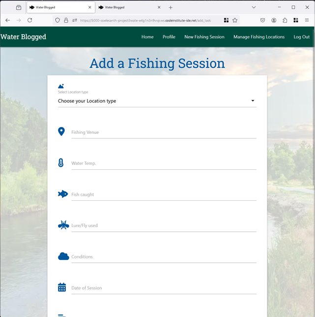

# Testing

> [!NOTE]  
> Return back to the [README.md](README.md) file.

The structure of the Testing for "Water Blogged" is as follows  

## Feature Testing:

### Usability Testing
- User can register and password are checked for consistency
- the navigation bar functions correctly 
- User can Logon and logoff
- User can create, update and delete their own records  
- The session rating function is working 
- The geo-location recording is working

### Defence programming 

In this section we test that users can only access features and functionality they are supposed to be able to access 
This would include 
- Performing CRUD operations only on records that they have created  
- Superuser have access to Super user functions and normal user do not 
- Normal user not being able to brute force there way into pages to access super user features

## Compatibility Testing:

- Browser Compatibility: Testing on different browsers (Chrome, Firefox, Safari, Edge, etc.) to ensure consistent performance.
- Device Compatibility: Ensuring functionality across various devices (desktops, laptops, tablets, and mobile phones).

## Regression Testing:

## Documentation and Logs:

Maintain records of testing procedures, results, and any bugs encountered along with their resolutions. This helps demonstrate a systematic approach to testing and problem-solving.
User Feedback Incorporation:

If applicable, mention how user feedback has been taken into account and implemented to enhance the user experience.

## Code Validation
 the following items were code checked 
 - HTML
 - Javascript
 - Python
 - CSS

### HTML

I have used the recommended [HTML W3C Validator](https://validator.w3.org) to validate all of my HTML files.

| Directory | File | Screenshot | Notes |
| --- | --- | --- | --- |
| templates | add_tasks.html | | |
| templates | edit_task.html |  | |
| templates | login.html |  | |
| templates | profile.html |  | |
| templates | register.html |  | |
| templates | tasks.html |  | |
| templates | categories.html |  | |

### CSS

I have used the recommended [CSS Jigsaw Validator](https://jigsaw.w3.org/css-validator) to validate all of my CSS files.

All the errors found (x3 errors and x649 Warnings) were with frameworks that were being used on Water Blogged site,
the Errors were from: 
 - Leaflet
 - Materiaze 

The Warning were from
 - Font Awesome 

| Directory | File | Screenshot | Notes |
| --- | --- | --- | --- |
| static | style.css |  | |

### JavaScript

I have used the recommended [JShint Validator](https://jshint.com) to validate all of my JS files.

The JSHint tool showed only warning for the JSscript for the Leaflet Geo Location

| Directory | File | Screenshot | Notes |
| --- | --- | --- | --- |
| static | js_script.js |  |  Jscript for Materialize CSS functions |
| static | add_task.html |  |  Jscript for add in g location for geo-location function Leaflet  |
| static | edit_task.html |  |  Jscript for edit location for geo-location function Leaflet  |

### Python

I have used the recommended [PEP8 CI Python Linter](https://pep8ci.herokuapp.com) to validate all of my Python files.

| Directory | File | CI URL | Screenshot | Notes |
| --- | --- | --- | --- | --- |
|  | app.py | [PEP8 CI](https://pep8ci.herokuapp.com/https://raw.githubusercontent.com/Coelecanth/project3-waterBlogged/main/app.py) |  | |

## Browser Compatibility

| Browser | Home | add user | register | Notes |
| --- | --- | --- | --- | --- | 
| Chrome |  |  |  | Works as expected |
| Firefox |  |  |  | Works as expected |
| Edge |  |  |  | Works as expected |

## Responsiveness

🛑🛑🛑🛑🛑🛑🛑🛑🛑🛑-START OF NOTES (to be deleted)

Use this space to discuss testing the live/deployed site on various device sizes.

The minimum requirement is for the following 3 tests:
- Mobile
- Tablet
- Desktop

**IMPORTANT**: You must provide screenshots of the tested responsiveness, to "prove" that you've actually tested them.

Using the "amiresponsive" mockup image (or similar) does not suffice the requirements.
Consider using some of the built-in device sizes in the Developer Tools.

If you have tested the project on your actual mobile phone or tablet, consider also including screenshots of these as well.
It showcases a higher level of manual tests, and can be seen as a positive inclusion!

Sample responsiveness testing documentation:

🛑🛑🛑🛑🛑🛑🛑🛑🛑🛑-END OF NOTES (to be deleted)

I've tested my deployed project on multiple devices to check for responsiveness issues.

| Device | Home | Add | register | Notes |
| --- | --- | --- | --- | --- | 
| Mobile (DevTools) |  |  |  | Works as expected |
| Tablet (DevTools) |  |  |  | Works as expected |
| Desktop |  |  | | Works as expected |

## Lighthouse Audit

🛑🛑🛑🛑🛑🛑🛑🛑🛑🛑-START OF NOTES (to be deleted)

Use this space to discuss testing the live/deployed site's Lighthouse Audit reports.
Avoid testing the local version (especially if developing in Gitpod), as this can have knock-on effects of performance.

If you don't have Lighthouse in your Developer Tools,
it can be added as an [extension](https://chrome.google.com/webstore/detail/lighthouse/blipmdconlkpinefehnmjammfjpmpbjk).

Don't just test the home page (unless it's a single-page application).
Make sure to test the Lighthouse Audit results for all of your pages.

**IMPORTANT**: You must provide screenshots of the results, to "prove" that you've actually tested them.

Sample Lighthouse testing documentation:

🛑🛑🛑🛑🛑🛑🛑🛑🛑🛑-END OF NOTES (to be deleted)

I've tested my deployed project using the Lighthouse Audit tool to check for any major issues.

| Page | Mobile | Desktop | Notes |
| --- | --- | --- | --- |
| Home |  |  | Some minor warnings |
| About |  |  | Some minor warnings |
| Gallery |  |  | Slow response time due to large images |
| x | x | x | repeat for any other tested pages/sizes |

## Defensive Programming

🛑🛑🛑🛑🛑🛑🛑🛑🛑🛑-START OF NOTES (to be deleted)

Defensive programming (defensive design) is extremely important!

When building projects that accept user inputs or forms, you should always test the level of security for each.
Examples of this could include (not limited to):

Forms:
- Users cannot submit an empty form
- Users must enter valid email addresses

PP3 (Python-only):
- Users must enter a valid letter/word/string when prompted
- Users must choose from a specific list only

MS3 (Flask) | MS4/PP4/PP5 (Django):
- Users cannot brute-force a URL to navigate to a restricted page
- Users cannot perform CRUD functionality while logged-out
- User-A should not be able to manipulate data belonging to User-B, or vice versa
- Non-Authenticated users should not be able to access pages that require authentication
- Standard users should not be able to access pages intended for superusers

You'll want to test all functionality on your application, whether it's a standard form,
or uses CRUD functionality for data manipulation on a database.
Make sure to include the `required` attribute on any form-fields that should be mandatory.
Try to access various pages on your site as different user types (User-A, User-B, guest user, admin, superuser).

You should include any manual tests performed, and the expected results/outcome.

Testing should be replicable.
Ideally, tests cases should focus on each individual section of every page on the website.
Each test case should be specific, objective, and step-wise replicable.

Instead of adding a general overview saying that everything works fine,
consider documenting tests on each element of the page
(ie. button clicks, input box validation, navigation links, etc.) by testing them in their happy flow,
and also the bad/exception flow, mentioning the expected and observed results,
and drawing a parallel between them where applicable.

Consider using the following format for manual test cases:

Expected Outcome / Test Performed / Result Received / Fixes Implemented

- **Expected**: "Feature is expected to do X when the user does Y."
- **Testing**: "Tested the feature by doing Y."
- (either) **Result**: "The feature behaved as expected, and it did Y."
- (or) **Result**: "The feature did not respond to A, B, or C."
- **Fix**: "I did Z to the code because something was missing."

Use the table below as a basic start, and expand on it using the logic above.

🛑🛑🛑🛑🛑🛑🛑🛑🛑🛑-END OF NOTES (to be deleted)

Defensive programming was manually tested with the below user acceptance testing:

| Page | Expectation | Test | Result | Fix | Screenshot |
| --- | --- | --- | --- | --- | --- |
| Home | | | | | |
| | When the user is not logged on as a user, they should be able to see records, and have no ability to edit records  | Tested the feature by loading the default site page | The feature behaved as expected, and the page was loaded showing records without any edit function either on records or in the navbar | Test concluded and passed |  |
| | User (not logged on) cannot brute force there way to ADD records from home page | Tested this by copying the URL for add records (From a logged on user) and then pasting this into a browser, in the current not logged on session | The page reloaded with the message "You need to logon", loading the logon page. | Test concluded and passed |  |
| | User (not logged on) cannot brute force there way to EDIT records from home page | Tested this by copying the URL for edit records (From a logged on user) and then pasting this into a browser, in the current not logged on session | The page reloaded with the message "You need to logon", loading the logon page. | Test concluded and passed |  |
| | User (not logged on) cannot brute force there way to superuser features such as edit/add/categories | Tested this by copying the URL for edit categries (From a logged on superuser) and then pasting this into a browser, in the current not logged on session | The page reloaded with the message "You need to logon", loading the logon page. | Test concluded and passed |  |
| | Logged on user cannot brute force there way to EDIT records from home page for other peoples records  | Tested this by copying the URL for edit records (From a different logged on user) and then pasting this into a browser, in the current logged on session | The page reloaded with the message "You dont have access to this page", loading the home page. | Test concluded and passed | | 
| | Logged on standard user cannot brute force there way to superuser features such as edit/add/categories | Tested this by copying the URL for edit categries (From a logged on superuser) and then pasting this into a browser, in the current not logged on session. Was then repeated for the ADD categroies, EDIT categroies. | For each of tests, the result was the same. The page reloaded with the message "Access denied: superuser access only", loading the home page. | Test concluded and passed |  |
| | Logged on standard user cannot brute force there way to superuser feature of  delete categories | Tested this by copying the URL for edit categries (From a logged on superuser) and then pasting this into a browser, in the current not logged on session. The delte categories calls a modal. So in this test I copied just the Modal URL and appended this to URL for the site e.g.   "get_categories#modal-66b0ca41aa243e156b3aaa16" to test this. | The page reloaded with the message "Access denied: superuser access only", loading the home page. | Test concluded and passed |  |
Logon/Logout | | | | | |
| | When Logged in with a standard user level account, they should not see the edit categories in the navbar | Logged on with the standard account and was taken to the profile page | The feature behaved as expected, the navbar did NOT show the edit categories page and the profile text tells me "Im not a supperuser" | Test concluded and passed |  |
| | When Logged in with a super user level account, they should see the edit categories in the navbar | Logged on with the super user account and was taken to the profile page | The feature behaved as expected, the navbar DID show the edit categories page and the profile text tells me "I am a supperuser" | Test concluded and passed |  |
| | When the Logged on user presses the logout text the in the navbar | logge on user should be logged out and receive a flash message and be taken to the logon page | The feature behaved as expected, the user was logged out and recieved the flash message "You have been logged out" | Test concluded and passed |  |
| Register | | | | | |
| | On registerinfg wit the site, the site will perform a registration check to make sure your password mis correct it does this bay asking you to rpeat the password, so if the password do not match the it should fail the check | Tested this by creating anew user | The feature behaved as expected, and it did Y | Test concluded and passed |  |
| | Feature is expected to do X when the user does Y | Tested the feature by doing Y | The feature did not respond to A, B, or C. | I did Z to the code because something was missing |  |

🛑🛑🛑🛑🛑🛑🛑🛑🛑🛑-START OF NOTES (to be deleted)

Another way of performing defensive testing is a simple Pass/Fail for each test.
The assessors prefer the above method, with the full test explained, but this is also acceptable in most cases.

When in doubt, use the above method instead, and delete the table below.

🛑🛑🛑🛑🛑🛑🛑🛑🛑🛑-END OF NOTES (to be deleted)

| Page | User Action | Expected Result | Pass/Fail | Comments |
| --- | --- | --- | --- | --- |
| Home | | | | |
| | Click on Logo | Redirection to Home page | Pass | |
| | Click on Home link in navbar | Redirection to Home page | Pass | |
| Gallery | | | | |
| | Click on Gallery link in navbar | Redirection to Gallery page | Pass | |
| | Load gallery images | All images load as expected | Pass | |
| Contact | | | | |
| | Click on Contact link in navbar | Redirection to Contact page | Pass | |
| | Enter first/last name | Field will accept freeform text | Pass | |
| | Enter valid email address | Field will only accept email address format | Pass | |
| | Enter message in textarea | Field will accept freeform text | Pass | |
| | Click the Submit button | Redirects user to form-dump | Pass | User must click 'Back' button to return |
| Sign Up | | | | |
| | Click on Sign Up button | Redirection to Sign Up page | Pass | |
| | Enter valid email address | Field will only accept email address format | Pass | |
| | Enter valid password (twice) | Field will only accept password format | Pass | |
| | Click on Sign Up button | Asks user to confirm email page | Pass | Email sent to user |
| | Confirm email | Redirects user to blank Sign In page | Pass | |
| Log In | | | | |
| | Click on the Login link | Redirection to Login page | Pass | |
| | Enter valid email address | Field will only accept email address format | Pass | |
| | Enter valid password | Field will only accept password format | Pass | |
| | Click Login button | Redirects user to home page | Pass | |
| Log Out | | | | |
| | Click Logout button | Redirects user to logout page | Pass | Confirms logout first |
| | Click Confirm Logout button | Redirects user to home page | Pass | |
| Profile | | | | |
| | Click on Profile button | User will be redirected to the Profile page | Pass | |
| | Click on the Edit button | User will be redirected to the edit profile page | Pass | |
| | Click on the My Orders link | User will be redirected to the My Orders page | Pass | |
| | Brute forcing the URL to get to another user's profile | User should be given an error | Pass | Redirects user back to own profile |
| repeat for all remaining pages | x | x | x | x |

🛑🛑🛑🛑🛑🛑🛑🛑🛑🛑-START OF NOTES (to be deleted)

Repeat for all other tests, as applicable to your own site.
The aforementioned tests are just an example of a few different project scenarios.

🛑🛑🛑🛑🛑🛑🛑🛑🛑🛑-END OF NOTES (to be deleted)

## User Story Testing

🛑🛑🛑🛑🛑🛑🛑🛑🛑🛑-START OF NOTES (to be deleted)

Testing user stories is actually quite simple, once you've already got the stories defined on your README.

Most of your project's **features** should already align with the **user stories**,
so this should as simple as creating a table with the user story, matching with the re-used screenshot
from the respective feature.

🛑🛑🛑🛑🛑🛑🛑🛑🛑🛑-END OF NOTES (to be deleted)

| User Story | Screenshot |
| --- | --- |
| As a new site user, I would like to ____________, so that I can ____________. |  |
| As a new site user, I would like to ____________, so that I can ____________. |  |
| As a new site user, I would like to ____________, so that I can ____________. |  |
| As a returning site user, I would like to ____________, so that I can ____________. |  |
| As a returning site user, I would like to ____________, so that I can ____________. |  |
| As a returning site user, I would like to ____________, so that I can ____________. |  |
| As a site administrator, I should be able to ____________, so that I can ____________. |  |
| As a site administrator, I should be able to ____________, so that I can ____________. |  |
| As a site administrator, I should be able to ____________, so that I can ____________. |  |
| repeat for all remaining user stories | x |

## Bugs

🛑🛑🛑🛑🛑🛑🛑🛑🛑🛑-START OF NOTES (to be deleted)

This section is primarily used for JavaScript and Python applications,
but feel free to use this section to document any HTML/CSS bugs you might run into.

It's very important to document any bugs you've discovered while developing the project.
Make sure to include any necessary steps you've implemented to fix the bug(s) as well.

**PRO TIP**: screenshots of bugs are extremely helpful, and go a long way!

🛑🛑🛑🛑🛑🛑🛑🛑🛑🛑-END OF NOTES (to be deleted)

- JS Uncaught ReferenceError: `foobar` is undefined/not defined

    

    - To fix this, I _____________________.

- JS `'let'` or `'const'` or `'template literal syntax'` or `'arrow function syntax (=>)'` is available in ES6 (use `'esversion: 11'`) or Mozilla JS extensions (use moz).

    

    - To fix this, I _____________________.

- Python `'ModuleNotFoundError'` when trying to import module from imported package

    

    - To fix this, I _____________________.

- Django `TemplateDoesNotExist` at /appname/path appname/template_name.html

    

    - To fix this, I _____________________.

- Python `E501 line too long` (93 > 79 characters)

    

    - To fix this, I _____________________.

## Unfixed Bugs

🛑🛑🛑🛑🛑🛑🛑🛑🛑🛑-START OF NOTES (to be deleted)

You will need to mention unfixed bugs and why they were not fixed.
This section should include shortcomings of the frameworks or technologies used.
Although time can be a big variable to consider, paucity of time and difficulty understanding
implementation is not a valid reason to leave bugs unfixed.

If you've identified any unfixed bugs, no matter how small, be sure to list them here.
It's better to be honest and list them, because if it's not documented and an assessor finds the issue,
they need to know whether or not you're aware of them as well, and why you've not corrected/fixed them.

Some examples:

🛑🛑🛑🛑🛑🛑🛑🛑🛑🛑-END OF NOTES (to be deleted)

- On devices smaller than 375px, the page starts to have `overflow-x` scrolling.

    

    - Attempted fix: I tried to add additional media queries to handle this, but things started becoming too small to read.

- For PP3, when using a helper `clear()` function, any text above the height of the terminal does not clear, and remains when you scroll up.

    

    - Attempted fix: I tried to adjust the terminal size, but it only resizes the actual terminal, not the allowable area for text.

- When validating HTML with a semantic `section` element, the validator warns about lacking a header `h2-h6`. This is acceptable.

    

    - Attempted fix: this is a known warning and acceptable, and my section doesn't require a header since it's dynamically added via JS.

🛑🛑🛑🛑🛑🛑🛑🛑🛑🛑-START OF NOTES (to be deleted)

If you legitimately cannot find any unfixed bugs or warnings, then use the following sentence:

🛑🛑🛑🛑🛑🛑🛑🛑🛑🛑-END OF NOTES (to be deleted)

> [!NOTE]  
> There are no remaining bugs that I am aware of.
